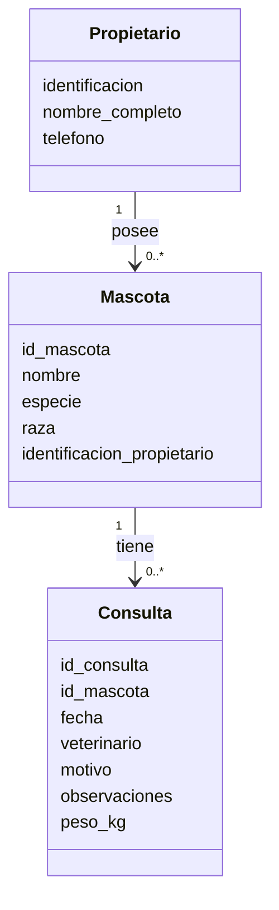

# DIS-001 - Diseño del Sistema PetCare

## Información del elemento de configuración

* Código del CI: DIS-001
* Nombre: Diseño del Sistema
* Categoría: Diseño
* Proyecto: PetCare
* Versión: 1.1
* Estado: Aprobado para línea base inicial
* Fecha: 06/10/2026
* Responsable: Equipo PetCare
* Ubicación: 01_Documentacion/02_Diseno/DIS-001_Diseno_Sistema.md

## Historial de versiones

| Versión | Fecha      | Descripción del cambio     | Responsable    |
| ------- | ---------- | -------------------------- | -------------- |
| 1.0     | 03/10/2026 | Diseño inicial del sistema | Equipo PetCare |
| 1.1     | 06/10/2026 | CR-001: se agrega el atributo peso_kg a la entidad Consulta | Juan David     |

## 1. Descripción general

PetCare se organiza en tres componentes principales:

1. Gestión de propietarios.
2. Gestión de mascotas.
3. Gestión de consultas e historial.

## 2. Entidades principales

### Propietario

La entidad Propietario contiene inicialmente los siguientes atributos:

* identificacion
* nombre_completo
* telefono

### Mascota

La entidad Mascota contiene:

* id_mascota
* nombre
* especie
* raza
* identificacion_propietario

### Consulta

La entidad Consulta contiene:

* id_consulta
* id_mascota
* fecha
* veterinario
* motivo
* observaciones
* peso_kg

## 3. Modelo de dominio

## 4. Relación entre requisitos y diseño

| Requisito                       | Elemento de diseño asociado         |
| ------------------------------- | ----------------------------------- |
| RF-01 Registrar propietario     | Entidad Propietario                 |
| RF-02 Registrar mascota         | Entidad Mascota                     |
| RF-03 Programar consulta        | Entidad Consulta                    |
| RF-04 Consultar historial       | Entidades Mascota y Consulta        |
| RNF-01 Integridad del historial | Decisión de diseño D-01 (sección 6) |

## 5. Flujo general

### Registro de propietario

1. El usuario ingresa la información del propietario.
2. El sistema valida los datos obligatorios y que la identificación no exista.
3. El sistema crea un objeto Propietario.
4. El sistema almacena la información.

### Registro de mascota

1. El usuario ingresa los datos de la mascota y la identificación del propietario.
2. El sistema verifica que el propietario exista.
3. El sistema crea un objeto Mascota y lo almacena.

### Programación de consulta

1. El usuario selecciona una mascota e ingresa los datos de la consulta.
2. El sistema verifica que la mascota exista, que la fecha sea válida y que el peso sea un número mayor que cero.
3. El sistema crea un objeto Consulta y lo almacena.

### Consulta de historial

1. El usuario indica el código de la mascota.
2. El sistema verifica que la mascota exista.
3. El sistema devuelve sus consultas ordenadas por fecha, incluyendo el peso de cada una.

## 6. Decisiones de diseño

### D-01 - Historial íntegro

En la versión 1.0 el sistema no ofrece operaciones para editar ni eliminar consultas ya registradas. Esta decisión permite proteger la integridad y trazabilidad del historial clínico. Cualquier cambio posterior sobre una consulta existente deberá ser evaluado mediante una solicitud de cambio formal y deberá conservar evidencia verificable del cambio.

## 7. Trazabilidad de diseño

Este diseño se deriva de los requisitos definidos en el elemento de configuración REQ-001 versión 1.0.

Cualquier modificación que afecte la estructura de propietarios, mascotas o consultas deberá evaluarse para determinar su impacto sobre este elemento de configuración.